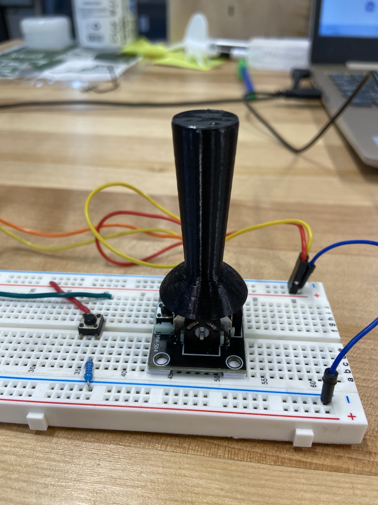

This project updated the mbed ble_mouse code to use as a powerchair joystick emulator. 

Changes were made to the joystick sensibility in the x-axis to resolve issues with joystick command inversion in the x-axis.
A deadzone was created for the joystick to limit jittering in the mouse, and ensure that no mouse movement occurred when the joystick was not in use. 

The powerchair emulator required the following parts: 
  - 1 Arduino Nano 33 BLE
  - 1 NO Switch 
  - 1 Analog Joystick (we used a HiLetgo Game Joystick)
  - 1 Solderless Breadboard
  - 4 Female to Male Jumper Wires
  - 1 220 Ohm Resistor
  - Numerous Male Jumpers or Coated Tinned Copper Wire 
  - Wire Strippers/Cutters (optional: only for use with copper wire)
  - 1 Custom Carrot Joystick Knob (optional: used to facilitate control)

Emulator Setup: 
  - Insert the male headers of the Arduino device into the solderless breadboard
  - Connect the red/positive rail of the Arduino to Voltage (3.3V) and the blue/negative rail to GND
  - Setup the NO switch and Analog Joystick where you want to place them on the board 
  - Connect the NO switch to Digital Pin 2 (D2), voltage (positive rail), and GND (negative rail) via 220 Ohm resistor 
  - Connect the x-axis of the joystick (VRx) to Analog Pin 6 (A6) 
  - Connect the y-axis of the joystick (VRy) to Analog Pin 7 (A7)
  - Connect the voltage input pin of the joystick to the positive rail
  - Connect GND on the joystick to the negative rail 

To add on the custom joystick knob to the emulator design, download the attached stl, open it with 3D printing software, and edit the print settings as needed. 
If the joystick knob is to be used with a different analog joystick than the HiLetgo Game Joystick, the extruded cut on the bottom surface of the part will need to be edited to fit the joystick of your choice.
In this case, open the attached STEP file using your preferred CAD software, or the attached SLDPRT using SolidWorks, and edit the extruded cut to fit your joystick.
